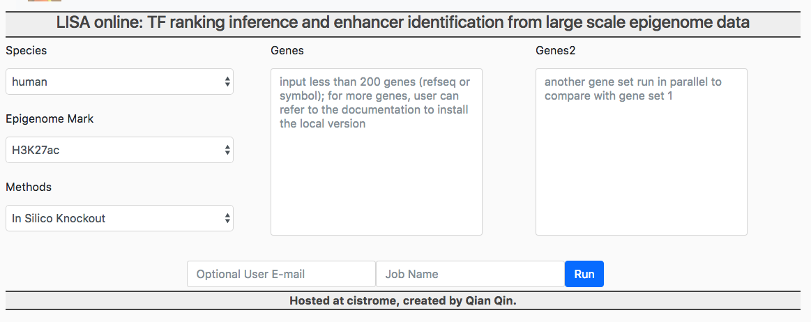
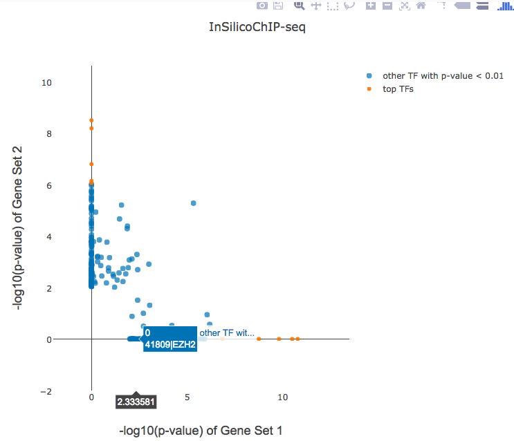
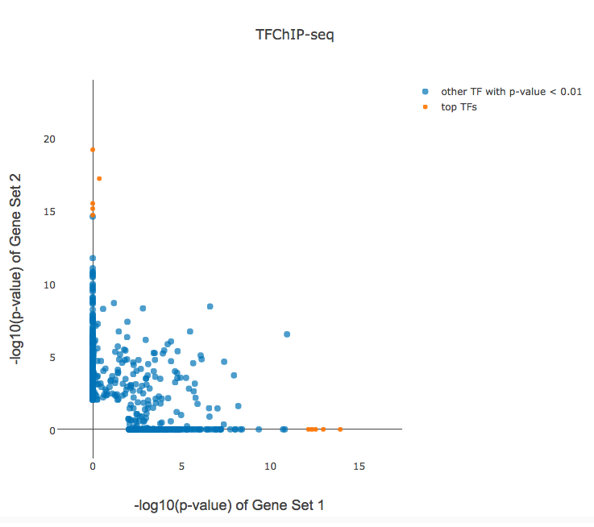
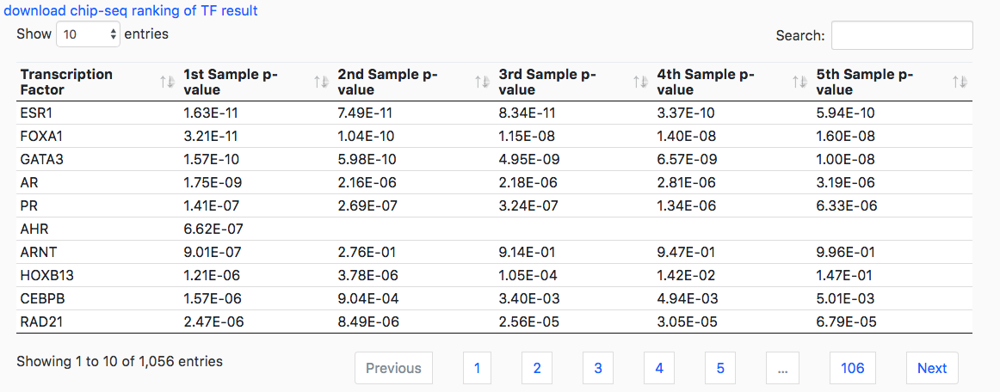
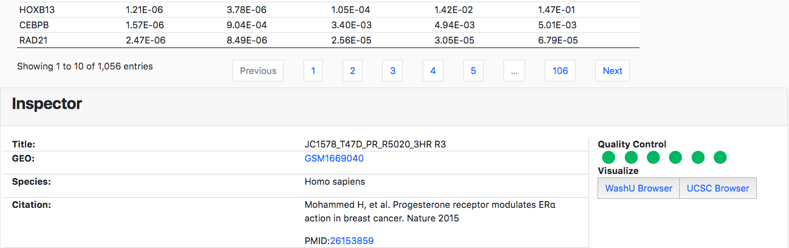
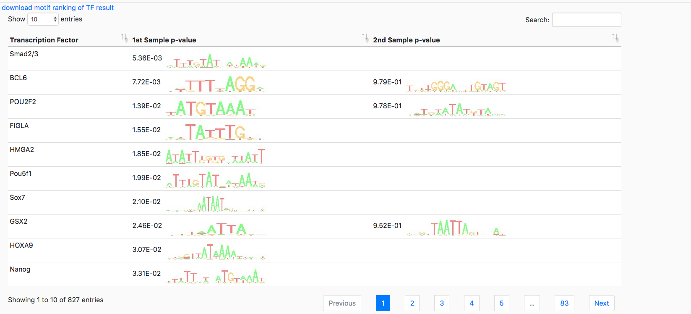
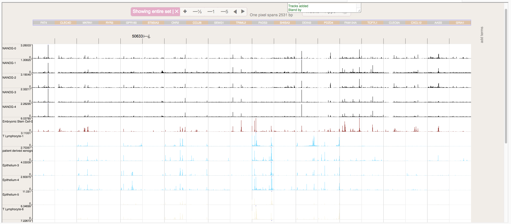

Tutorial
=============

LISA is used to link chromatin profile to gene set from any stimuls experiment of gene expression, the input is a gene set, the output is the ranking of the transcription factor, it is based on the large-scale dataset from Cistrome database. User can use the online version or local standalone version.

LISA includes 4 methods: In silico knockout (the best), cluster method, BETA method, baseline method. Only knockout and BETA methods are supported for online version. For users with gene set more than 200, consider install the local version.

Standalone version
~~~~~~~~~~~~~~~~~~~~

The LISA framework has three pipeline represented with three sub-parser, `model`, `multiple_fastq2bigwig`, and `multiple_bigwig2hdf`;
The TF rank method is run through the `model` sub-parser.

Run all the methods
------------------------

.. code-block:: bash
   :linenos:

   lisa model --method='all' --web=False \
              --new_rp_h5=None --new_count_h5=None \
              --species hg38 --epigenome "['H3K27ac']" \  
              --cluster=True --covariates=False \
              --random=True \
              --prefix test_function1 \
              --threads 8 test.gene_symbol

Options:
The `test.gene_symbol` is the gene set user input, which is a text file with one official gene symbol or refseq id, mixture of the both is not supported yet, this is used as a prefix for output, so put the file in a directory with written permission.

--epigenome controls the histone mark or DNase to use in the features.

Run only one method
-------------------------------------
1. run only the knockout or beta method:
   --method option can control the method to run knockout or beta method, use it with the option --web=True to turn off the baseline method.

.. code-block:: bash
   :linenos:

   lisa model --method='knockout' \
              --web=True --new_rp_h5=None \
              --new_count_h5=None --species hg38 \
              --epigenome "['H3K27ac']" \
              --cluster=False --covariates=False \
              --random=True \
              --prefix test_function1 --threads 8 test.gene_symbol

   lisa model --method='beta' \ 
              --web=True \
              --new_rp_h5=None --new_count_h5=None \ 
              --species hg38 --epigenome "['H3K27ac']" \
              --cluster=False --covariates=False \
              --random=True \
              --prefix test_function1 --threads 8 test.gene_symbol

2. run only the cluster method to rank

.. code-block:: bash
   :linenos:

   lisa model --method='none' \
              --web=True --new_rp_h5=None \
              --new_count_h5=None --species hg38 \
              --epigenome "['H3K27ac']" --cluster=True \
              --covariates=False --random=True \
              --prefix test_function1 --threads 8 test.gene_symbol

Understanding Output
---------------------
Take *AR.symbol* input and histone mark *H3K4me3* as an example. By using the above command, the key results are as follows,

=======================================================   ===============================================================================  =============================================================================
Output File                                               Content                                                                          Instruction
=======================================================   ===============================================================================  =============================================================================
AR.symbol.premodel_records.txt                            regulatory potential cluster-based regression performance and coefficients       one row is PRAUC,AUC,lambda, 2nd row is coefficients
AR.symbol_motif99_baseline.csv                            baseline method based on motif hit between differential & control gene           one row is motif_id|TF_name,p-value
AR.symbol_chipseq_baseline.csv                            baseline method based on chip-seq peak hit between differential & control gene   one row is CistromeID|TF_name,p-value
AR.symbol.gene_symbol.H3K4me3.coefs.csv                   Regression coefficients for H3K4me3                                              one row is CistromeID,coefficient,cell type, cell line, tissue
AR.symbol.H3K4me3.lisa_predicted_rp.csv                   predicted differential expression log probability                                one row is refseq,log probability
AR.symbol.H3K4me3.gene_set.performance                    differential gene prediction                                                     one row is AUC,PRAUC
AR.symbol.lisa_direct.csv                                 BETA TF ranks based on random background or epigenetic background                one row is CistromeID|TF_name,p_value
AR.symbol.gene_symbol.H3K4me3.motif99.p_value.csv         motif insilco knockout result for H3K4me3                                        one row is motif_id|TF_name,p-value
AR.symbol.H3K4me3.chipseq.p_value.csv                     TF ChIP-seq insilco knockout result for H3K4me3                                  one row is motif_id|TF_name,p-value
AR.symbol.gene_symbol.H3K4me3.motif99.entropy_rank.csv    motif-based TF ranks from KL divergence method                                   one row is  motif_id|TF_name,KLD,rank
AR.symbol.gene_symbol.H3K4me3.chipseq.entropy_rank.csv    ChIP-seq-based TF ranks from KL divergence method                                one row is  motif_id|TF_name,KLD,rank|
=======================================================   ===============================================================================  =============================================================================

Web Version
~~~~~~~~~~~~~~~~~~~~~~
The web version is intuitive to use, just copy and paste a gene list (one row a gene), and submit your job. One hidden tip is that each p-value in the output table can be click to view the dataset information from Cistrome Data Browser.

FAQ
-----------------
1. What does LISA do? What do I need to run LISA?

LISA is short for Large scale In Silico Analysis. LISA is a computational method that uses chromatin data from a comprehensive database of human and mouse DNase-seq, ATAC-seq and ChIP-seq profiles(H3K27ac, H3K4me3, H3K4me1, H3K27me3), to determine the transcription factors and chromatin regulators that are directly responsible for the perturbation of a differentially expressed gene set. To run LISA, the only thing you need is the differential gene list from whatever biological process you are interested in. Then you will be able to leverage the power of the most comprehensive DNase and ChIP-seq database (CistromeDB) to discover the underlying regulatory mechanisms, reveal the key transcription factors and chromatin regulators and also their binding sites!

2. How many datasets are there?

For now (May 3rd, 2018), the dataset statistics is as the table below. 

+------------+------------+-----------+ 
| Category   | Human      | Mouse     | 
+============+============+===========+ 
| DNase-seq  | 1,110      | 359       | 
+------------+------------+-----------+ 
| H3K27ac    | 1,545      | 1,031     | 
+------------+------------+-----------+ 
| H3K27me3   | 842        | 932       | 
+------------+------------+-----------+ 
| H3K4me3    | 1,432      | 1,032     | 
+------------+------------+-----------+ 
| H3K4me1    | 726        | 590       | 
+------------+------------+-----------+ 
| TF and CR  | 6,773      | 4,363     | 
+------------+------------+-----------+ 
| Total      | 12,428     | 8,307     |
+------------+------------+-----------+ 

   Table 1. Chromatin profile data and TF/CR ChIP-seq dataset

3. How does LISA work?

First, LISA will bulid a chromatin environment model using the input gene list based on the comprehensive database of DNase-seq, ATAC-seq or histone modification profiles. The model would try to match the cell type specific chromatin environment as good as possible. Then, for each gene, LISA will probe the effect of transcription factors in these environments by simulating deletions of their binding sites. The binding sites could come from the ChIP-seq data in cistromeDB or the motif hit profile. Finally, LISA would assign every binding site profile(ChIP-seq data or motif hit profile) a significance value showing how important the set of binding sites is by evaluating the effect across all the input genes.

4. Which mark should I choose?
Well, as we can see in the input interface (Figure 1), there are DNase-seq, ATAC-seq and ChIP-seq profiles(H3K27ac, H3K4me3, H3K4me1, H3K27me3) for us to choose. From the set of transcription factor perturbation experiments used as benchmarks in the paper, we found that DNase and H3K27ac would always show the best performance, so these two should be the default setting. If you know that the biological process you are looking at is associated with some other mark, it would be interesting to have a try using that mark.

   Figure 1. Input interface

5. How many differential genes should I use?

User can input one gene set or two gene set (Figure 1). If only one gene set is given, the TF ranking list would be provided. If two are given, the comparison figure will be generated, a typical scenario would input up and down regulated gene set from one expression profile experiment. We would recommend 50 to 500, since few genes will lower the predictive power of chromatin profile modelling. To build a model that can best represent the cell type specific chromatin environment, the number of genes can not be too few. However, because of the time-consuming step of deleting binding sites for all the ChIP-seq profile and motif hit profile for all the input genes, the LISA running time would suffer from the number of genes when it goes beyond 500. 

6. What kind of results LISA offer?

a. a pairwise scatterplot for LISA cis-elements knockout (Figure 2) and direct prediction from TF ChIP-seq methodologies (Figure 3) will be generated if two gene sets are given(optional). The x axis and y axis shows the -log10(p-value) of the TF ranking significance for either gene set. Once user mouse over the points, the corresponding TF ChIP-seq sample will be shown by Cistrome ID and TF name.

Figure 2. LISA in-silico knockout method demo

Figure 3. LISA prediction directly from TF ChIP-seq demo

b. The ranking table of the LISA cis-elements knockout and direct prediction from TF ChIP-seq methodologies for ChIP-seq based TF ranking from either of the gene sets (Figure 4). Click each of the p-value, the Cistrome dataset link will be shown below (Figure 5).

Figure 4. LISA TF ranking based on ChIP-seq

Figure 5. Cistrome dataset link

c. The ranking table for Motif PWM based TF ranking.

Figure 6. TF ranking based on chromatin profile knockout of Cistrome Motif

d. selected chromatin profile and model performance.
The annotation and the coefficient of the selected chromatin profile is selected. In this panel, user can also select a row to view the Cistrome dataset. Along with the table, there is the ROCAUC curve to show the model performance.

.. figure:: _static/7.png
Figure 7. selected chromatin profile and model performance

e. WashU genome browser for gene set enrichment
we randomly picked arbitrarily 20 genes from the differential gene set to generate the genome tracks for the top ranked TF ChIP-seq, selected chromatin profile ChIP-seq for both gene set 1 (e.g. up regulated) and gene set 2 (e.g. down regulated) gene set (Figure 8).

Figure 8. gene set enrichment view mode of Wash U genome browser 

